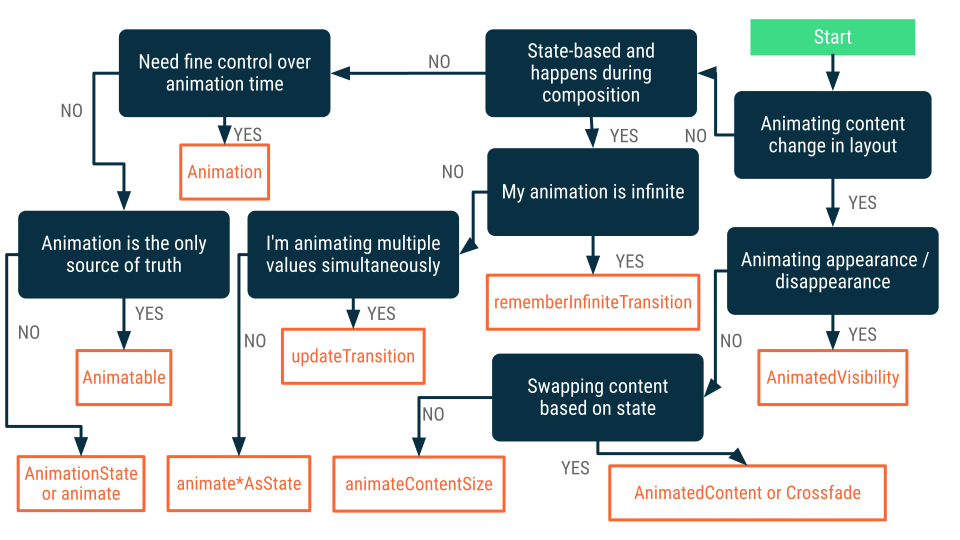
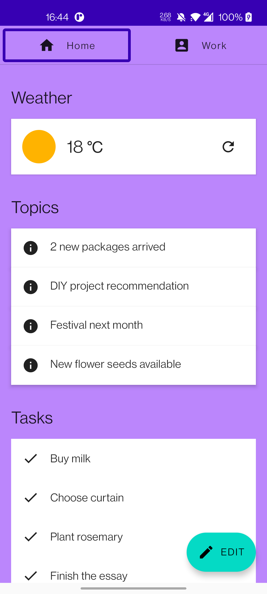
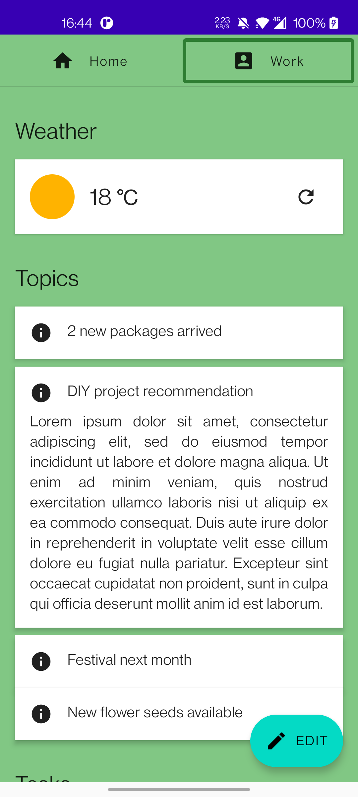
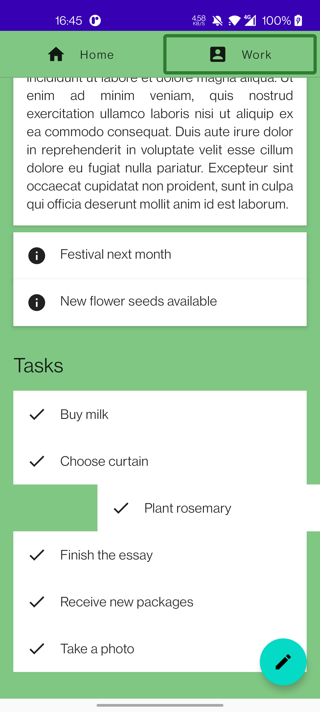

# Animation

通过Animation我们可以学习到：

- 如何使用基本的动画API
- 什么时候使用哪一种动画API

`compose`提供了功能丰富的动画API，当面对不同的实际场景时，面对多种多样的API可能会感到手足无措，到底该使用哪一种API将会是你所面临的一个头痛的问题，通过下图的思路，你将可以确定使用哪一种动画API来实现你想要的结果：

## 预览

|  |  |  |
| --------------------------------------- | -------------------------------------- | -------------------------------------- |
