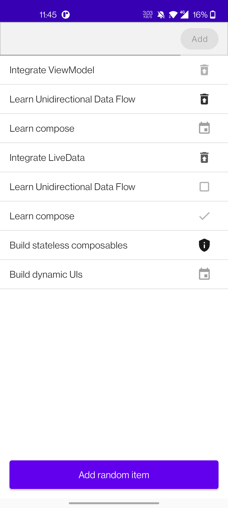
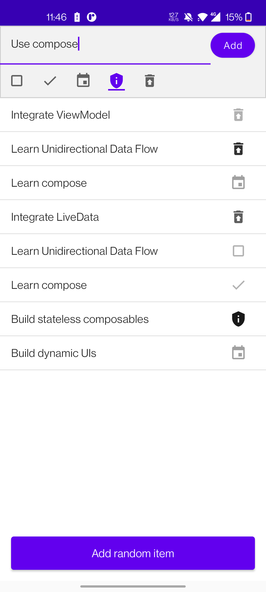
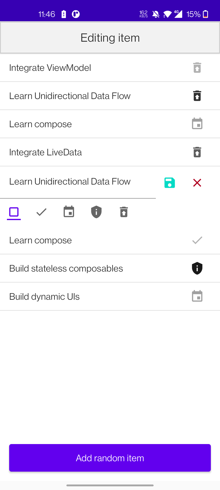

# Todo
通过Todo可以学习到：

- 什么是单向数据流，即state flow down，event flow up(状态下沉，事件提升)
- 将Compose与ViewModel搭配使用
- 什么是有stateful compose以及stateless compose，stateful compose就是保存有可以随时改变的状态的compose，stateless compose就是不保存用于更新的状态的compose。
- 如何将stateful compose通过状态提升转变为stateless compose，将stateful compose转变为stateless compose可以提高灵活性和复用性。
- 如何通过state实现动态UI

## 预览

|  |  |  |
| --------------------------------------- | -------------------------------------- | -------------------------------------- |

